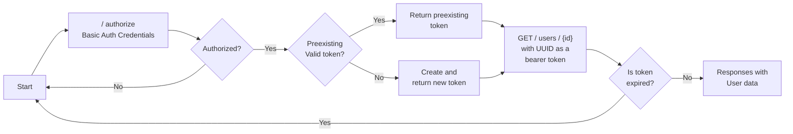

<h1>API/Backend service for GeoEvent project</h1>

<h3>Authorization flow chart</h3>

<h3>API Endpoints</h3>
<h3>Users</h4>
<table>
<tr>
    <th>Type</th>
    <th>Endpoint</th>
    <th>Request data</th>
    <th>Response data</th>
    <th>Permission</th>
    <th>Comments</th>
</tr>
<tr>
    <td>GET</td>
    <td>/ users</td>
    <td></td>
    <td>All users</td>
    <td>Admin</td>
    <td>Get all users</td>
</tr>
<tr>
    <td>POST</td>
    <td>/ users</td>
    <td>data type User</td>
    <td>User</td>
    <td>Any</td>
    <td>Create user</td>
</tr>
<tr>
    <td>GET</td>
    <td>/ users / {id}</td>
    <td>UUID: id</td>
    <td>User</td>
    <td>Admin, User</td>
    <td>Get user data from id</td>
</tr>
<tr>
    <td>PUT</td>
    <td>/ users / {id}</td>
    <td>data type User</td>
    <td>User</td>
    <td>Admin, User</td>
    <td>Change specific user data</td>
</tr>
</table>

<h3>Authorize</h3>
<table>
<tr>
    <th>Type</th>
    <th>Endpoint</th>
    <th>Request data</th>
    <th>Response data</th>
    <th>Permission</th>
    <th>Comments</th>
</tr>
<tr>
    <td>POST</td>
    <td>/ authorize</td>
    <td>data type Credentials</td>
    <td>UUID: Token</td>
    <td>Any</td>
    <td>Authorize with credentials</td>
</tr>
</table>
